\setcounter{page}{0}
\newpage

# 背景

在本報告中，針對 Flowers102 資料集進行分類實驗，使用多種深度學習模型進行對比與分析，旨在評估不同模型、優化器、 Activation Function 及其他設定對分類性能的影響。

# 模型使用

此次實驗選用了以下模型進行對比：Simple-Net、ResNet-18、ResNet-34、ResNet-50、ResNet-101、ResNet-152。這些模型涵蓋了從基礎網絡到較深層次的殘差網絡，有助於分析深度對分類準確率的影響。

# 實驗設定

本次實驗中，針對每個模型和資料集進行了一系列的參數微調。以下為實驗的初始設定，並在後續章節中將討論具體的結果與調整過程。

## 隨機種子

為了確保實驗結果的可重現性，統一設定隨機種子為 `42`。

## 資料前處理

資料前處理步驟包括隨機增強與標準化。以下為訓練資料的隨機變換設定：

```python
transform_train_augmented = transforms.Compose([
    transforms.Resize((256, 256)),
    transforms.RandomResizedCrop(224, scale=(0.3, 1.0)),
    transforms.RandomHorizontalFlip(p=0.5),
    transforms.RandomRotation(degrees=30),
    transforms.ColorJitter(brightness=0.2, contrast=0.2, saturation=0.2, hue=0.1),
    transforms.RandomGrayscale(p=0.2),
    transforms.ToTensor(),
    transforms.Normalize([0.485, 0.456, 0.406], [0.229, 0.224, 0.225])
])
```

訓練資料集：6149（原始）+ 6149（隨機增強後）= **12298** 筆\
驗證資料集：**1020** 筆\
測試資料集：**1020** 筆

下圖展示了訓練資料集的標籤分佈情況：

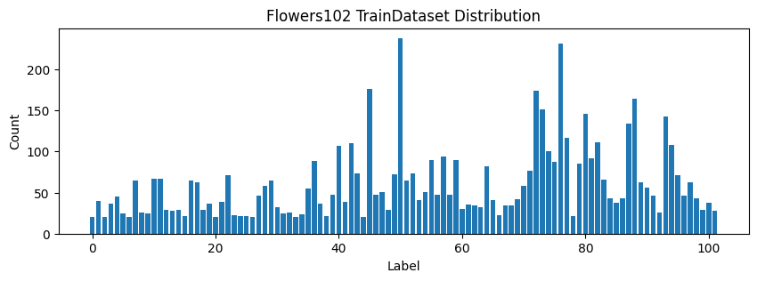{ align=center }

### 標籤平衡化

為了解決資料集中標籤不平衡的問題，使用了 `WeightedRandomSampler` 及 過採樣/欠採樣 等方法進行標籤平衡化處理。

WeightedRandomSampler: 根據每個標籤的數量，計算出每個標籤的權重，並根據權重進行抽樣。這樣可以保證每個標籤的數量接近平均值，而解決標籤不平衡的問題。

過採樣/欠採樣策略：計算出標籤平均，並根據每個標籤的數量，進行過採樣/欠採樣，使每個標籤的數量接近平均值。平均整數值為 60 張，最終資料集為 6120 張。

## 模型定義

- **Simple-Net**：包含 3 層卷積層和 3 層全連接層的簡單網絡結構。
- **ResNet**：1 層初始卷積層後接 4 個殘差塊。
  - **BasicBlock**：包含 2 層卷積層。
  - **BottleneckBlock**：包含 3 層卷積層。
  - **ResNet-18**：每層殘差塊由 2 個 BasicBlock 組成。
  - **ResNet-34**：殘差塊配置為 3, 4, 6, 3 個 BasicBlock。
  - **ResNet-50**：殘差塊配置為 3, 4, 6, 3 個 BottleneckBlock。
  - **ResNet-101**：殘差塊配置為 3, 4, 23, 3 個 BottleneckBlock。
  - **ResNet-152**：殘差塊配置為 3, 8, 36, 3 個 BottleneckBlock。

## 模型初始化

所有模型參數均使用 Kaiming Initialization 進行初始化，確保模型在 Activation Function 為 ReLU 等非線性函數時具備更好的收斂特性。

## Activation Function

對比了 ReLU、LeakyReLU 和 SiLU 三種 Activation Function 的表現，以評估不同 Activation Function 對模型性能的影響。

## Loss function

使用 CrossEntropyLoss 作為loss function，用於多類別分類問題的標準損失計算。

## Optimizer

本次實驗比較了三種常見的優化器：SGD、Adam 和 Nadam，具體的參數如下：

- SGD: 學習率 `0.001`，動量 `0.9`，權重衰減 `1e-4`
- Adam: 學習率 `0.001`，權重衰減 `1e-4`
- Nadam: 學習率 `0.001`，權重衰減 `1e-4`

## Scheduler

實驗中嘗試了 StepLR、CosineAnnealingLR 和 ReduceLROnPlateau 三種學習率調整策略，以評估不同策略對模型性能的影響。

### ReduceLROnPlateau 未正確運作

原先在訓練過程中，發現 ReduceLROnPlateau Scheduler 未能正確實現。原因是因為一開始並沒有切分 validation set，而我使用 train set loss 來調整學習率，導致學習率無法正確調整。後來將 validation set 加入後，Scheduler 正常運作。

<!-- ## Mlflow 訓練記錄

使用 Mlflow 進行訓練記錄，方便後續分析與比較。 -->


# 結果分析與比較

以下為 ResNet-50 使用三種 Activation Function 的結果比較（各自採用最佳化策略）：

| Activation Function | 測試結果 | 訓練準確率 |
| --- | --- | --- |
| ReLU | 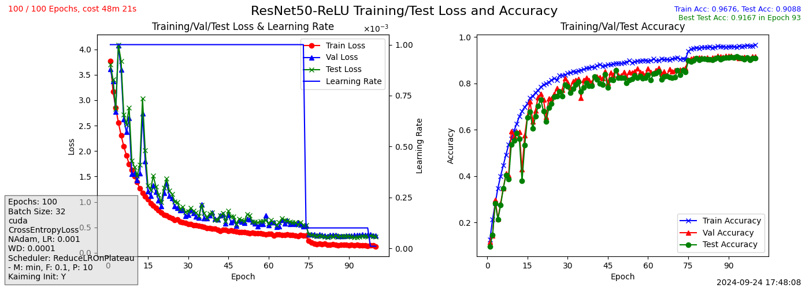{width=50%} | 0.9167 |
| LeakyReLU | 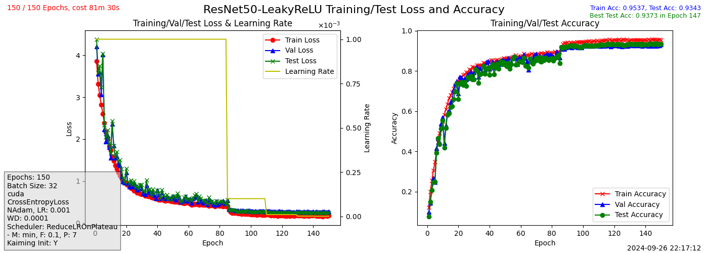{width=50%} | 0.9373 |
| SiLU | 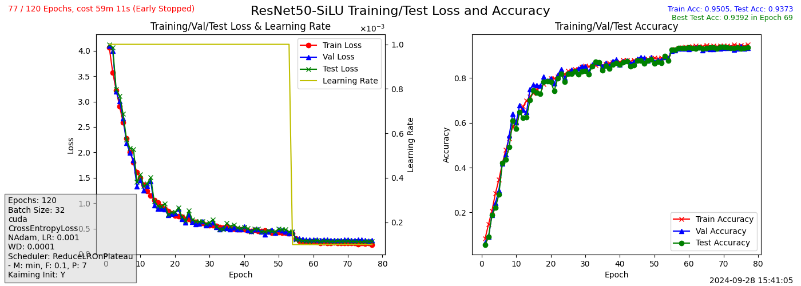{width=50%} | 0.9392 |

從上表可見，SiLU 激活函數在 ResNet-50 上達到了最佳效果，測試準確率達 93.92%。相比之下，使用 ReLU 時，模型在驗證集與測試集上的準確率普遍低於訓練集，顯示出一定程度的過擬合。LeakyReLU 能減緩這種過擬合現象，測試準確率也有所提升。

SiLU 則進一步提升了驗證集與測試集的準確率，甚至超過了訓練準確率。這主要是因為 SiLU 的平滑特性及其對負輸入的非零響應，使其能更好地捕捉複雜數據的特徵，從而提高模型的泛化能力。同時，SiLU 也能有效減少梯度消失問題，對於深層網絡特別有利，保持梯度的穩定傳遞，進一步提升模型性能。

## 模型比較

以下是不同模型的結果比較（各自採用最佳化策略，具體超參數詳見附錄）：

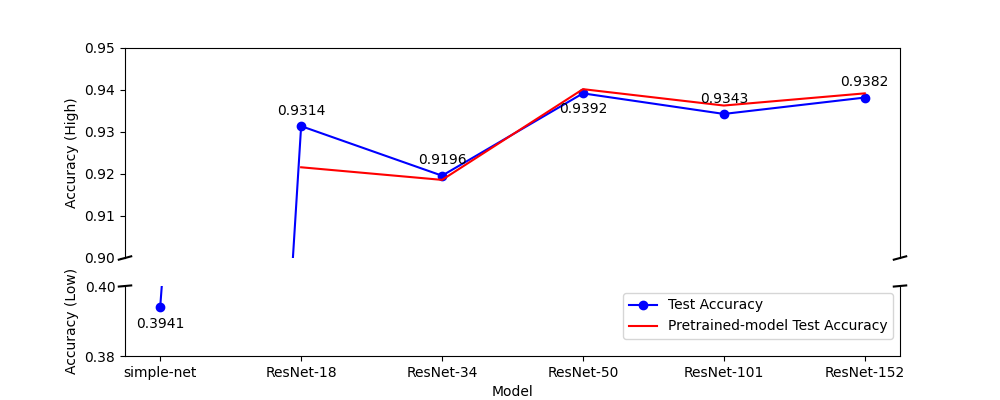{ align=center }

從圖中可以看出，從 ResNet-18 到 ResNet-152 的準確率差距不到 1%，其中 ResNet-18 的測試準確率已經超過 0.93，因此在這個資料集上，ResNet-18 已經足夠應付實際需求。

同時，ResNet-101 和 ResNet-152 的準確率並未顯著提升，可能是由於 flower102 資料集較小，模型過於複雜導致難以找到最佳超參數。此外，ResNet-101 和 ResNet-152 的測試準確率通常略高於訓練準確率（詳見附錄），這表明它們在此資料集上的泛化能力較強。若能對資料集進行進一步增強與改進，這些深層模型或許能獲得更好的結果。

SimpleNet 是一個較為基礎的網絡結構，僅包含 3 層卷積層和 3 層全連接層。在實驗中，SimpleNet 的測試準確率僅達 39.41%，遠低於 ResNet 系列的表現，顯示出其對於較複雜資料集的能力有限，無法有效捕捉深層次的特徵。

值得注意的是，雖然 Pretrained Model 的準確率不算特別高，但在極短的訓練時間內就能與其他模型達到相近的準確率，展現了其在快速應用中的潛力。

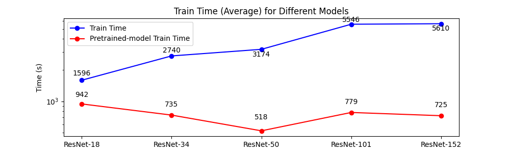{ align=center }

<!-- 
simplenet .3941: ./assets/SimpleNet_120_64_False_CrossEntropyLoss_SGD_0.001_0_0_None_20240929002128.png
resnet18 .9284: ./assets/ResNet18-ReLU_125_16_True_CrossEntropyLoss_SGD_0.001_0.9_0.0005_ReduceLROnPlateau_min_0.1_7_20240927040043.png
resnet18-pretrained .9216: ./assets/ResNet18-pretrained_120_16_False_CrossEntropyLoss_SGD_0.001_0.9_0.0005_ReduceLROnPlateau_min_0.1_7_20240929024842.png
resnet34 .9196: ./assets/ResNet34-LeakyReLU_250_32_True_CrossEntropyLoss_NAdam_0.001_0_0.0001_ReduceLROnPlateau_min_0.1_10_20240926204953.png
resnet34-pretrained .9186: ./assets/ResNet34-pretrained_120_32_False_CrossEntropyLoss_NAdam_0.001_0_0.0001_ReduceLROnPlateau_min_0.1_7_20240928212401.png
resnet50 .9392: ./assets/ResNet50-SiLU_120_32_True_CrossEntropyLoss_NAdam_0.001_0_0.0001_ReduceLROnPlateau_min_0.1_7_20240928154105.png
resnet50-pretrained .9402: 
./assets/ResNet50-pretrained_120_32_False_CrossEntropyLoss_NAdam_0.001_0_0.0001_ReduceLROnPlateau_min_0.1_6_20240929034444.png
resnet101 .9343: ./assets/ResNet101-LeakyReLU_150_32_True_CrossEntropyLoss_NAdam_0.001_0_0.0001_ReduceLROnPlateau_min_0.1_10_20240926123023.png
resnet101-pretrained .9363:
ResNet101-pretrained_120_32_False_CrossEntropyLoss_NAdam_0.001_0_0.0001_ReduceLROnPlateau_min_0.1_5_20240929122214.png
resnet152 .9382: ./assets/ResNet152-LeakyReLU_150_32_True_CrossEntropyLoss_NAdam_0.001_0_0.0001_ReduceLROnPlateau_min_0.1_7_20240926063847.png
resnet152-pretrained .9392: ./assets/ResNet152-pretrained_120_64_False_CrossEntropyLoss_NAdam_0.001_0_0.0001_ReduceLROnPlateau_min_0.1_5_20240929124104.png
 -->

## 資料處理比較

接下來比較使用不同資料處理方法的結果，以下使用 ResNet-18 進行比較：

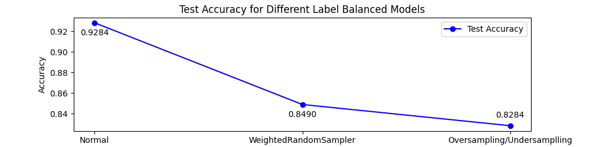{ align=center }

下圖顯示了兩種不同的資料處理方法在訓練過程中的表現：

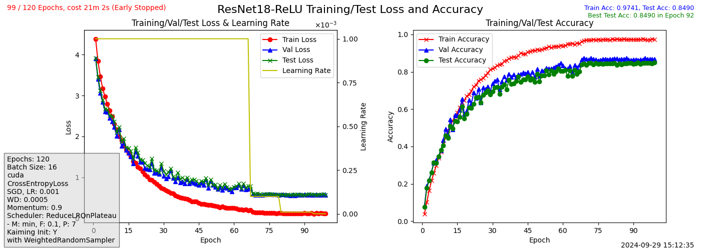{width=50%}
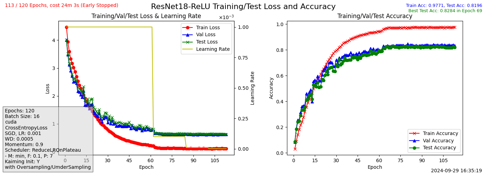{width=50%}

從結果可以看出，儘管使用不同的資料處理方法，模型在訓練時都能取得超過 97% 的準確率，而未經標籤平衡處理的模型則無法達到這樣的效果。然而，這些經過標籤平衡處理的模型在驗證集上的準確率仍然下降，顯示出一定程度的過擬合，說明模型在訓練資料上學習良好，但在測試和驗證資料上的泛化效果不如預期。

有趣的是，原始資料集的效果反而最好，這表明某些資料處理方法在這個情況下並沒有帶來期望中的改進。雖然未能明確找出原因，但推測可能是資料處理方法造成了特徵的扭曲或數據分佈不一致，導致模型學習效果不穩定。

未來將進一步探討資料處理與模型表現的關係，嘗試更好的標籤平衡化方法或引入不同的模型來進行測試，以期望減少過擬合現象，並提升驗證集上的準確率。

## Scheduler Comparison

以下模型使用 ResNet-34， Activation Function 為 ReLU, Optimizer 為 Adam，比較了三種 Scheduler 的效果：

- StepLR: 學習率 `0.001`，每 15 個 epoch 乘以 0.3
- CosineAnnealingLR: 學習率 `0.001`，週期 20
- ReduceLROnPlateau: 學習率 `0.001`，監控 `min`，`factor` 0.1，`patience` 7 

此外，為了進一步比較效果，還進行了一組不使用 Scheduler 的實驗。

從結果可知，ReduceLROnPlateau 在監控損失變化時能最有效調整學習率，取得了 86.56% 的測試準確率，是三者中表現最好的。CosineAnnealingLR 雖然表現稍遜，但仍取得 84.71% 的準確率，展示出其在周期性調整學習率上的潛力。相比之下，StepLR 表現最差，準確率僅 65.12%，說明其學習率調整方式可能過於粗略，不適合這個模型與數據集的組合。

不使用 Scheduler 的情況下也取得了 85.69% 的準確率，略低於 ReduceLROnPlateau，但仍然優於 StepLR 和 CosineAnnealingLR，這顯示出在某些情況下，模型的基本訓練也能達到不錯的效果。

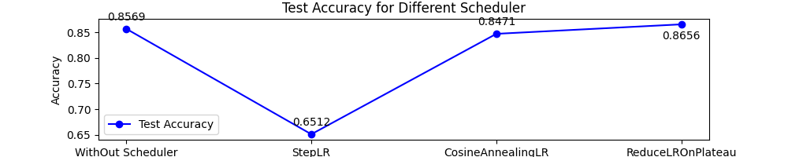{ align=center }

ReduceLROnPlateau 更具自適應性，能夠根據訓練過程中的表現靈活調整學習率，對於像 Flowers102 這類不平衡數據集特別有效。而 StepLR 的固定步長調整方式，則無法靈活適應不同階段的學習率需求。

<!-- 
0.8569 ./assets/ResNet34-ReLU_120_32_True_CrossEntropyLoss_Adam_0.001_0_0_None_20240929015802.png
0.8656 ./assets/ResNet34-ReLU_120_32_True_CrossEntropyLoss_Adam_0.001_0_0_ReduceLROnPlateau_min_0.1_7_20240928175820.png
0.8471 ./assets/ResNet34-ReLU_100_True_CrossEntropyLoss_Adam_0.001_0_0_CosineAnnealingLR_20_20240924122936.png
0.6512 ./assets/ResNet34-ReLU_100_True_CrossEntropyLoss_Adam_0.001_0_0_StepLR_15_0.3_20240923140127.png
 -->

## Confusion Matrix Analysis

下圖展示了使用 ResNet-18 模型（測試準確率為 0.9284）進行的混淆矩陣和分類報告分析。透過混淆矩陣，可以直觀地看到模型在不同類別上的預測表現。顏色越深代表預測結果越準確，對角線上的點顯示模型預測正確的比例較高，說明大多數類別的分類結果相對準確。然而，模型在某些類別上的錯誤分類情況，這可能與資料集不平衡或某些類別之間的特徵相似性有關。

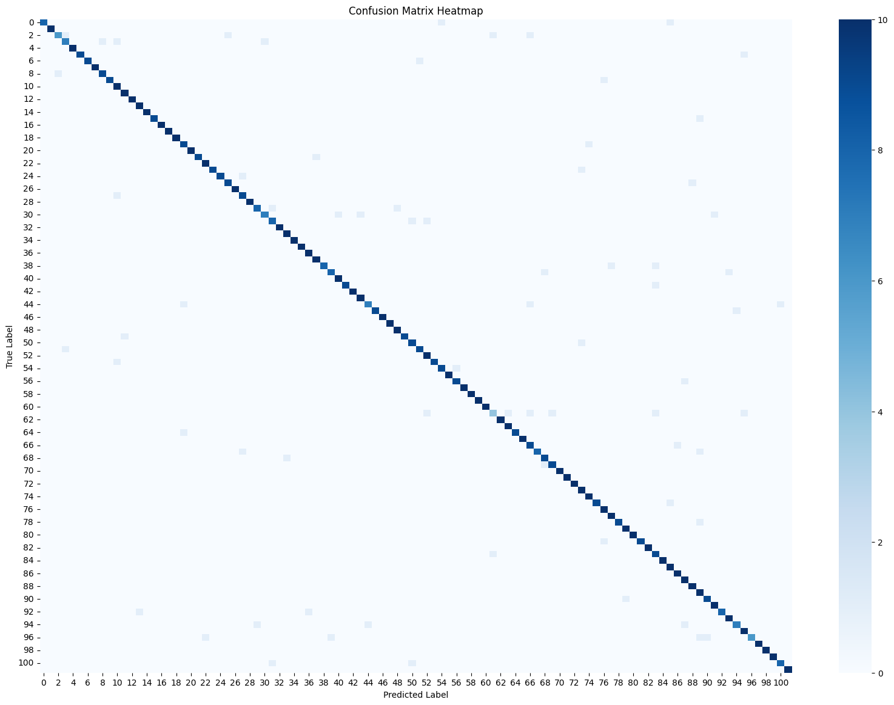{ width=48% }

此外，分類報告圖展示了模型在各個類別上的 Precision（精確率）、Recall（召回率）和 F1-score 的數據。整體來看，大部分類別的 Precision 和 Recall 都接近 0.7 以上，F1-score 也維持在較高水準，顯示模型對多數類別的預測效果穩定。

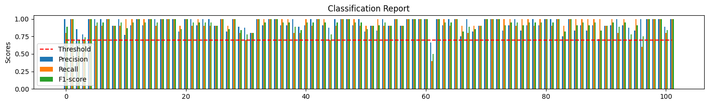{ align=center }、

# 架構錯誤反思

從以下四張圖表可以觀察到，ResNet-18 在訓練過程中並沒有出現明顯的收斂問題。然而，當使用 ResNet-34 和 ResNet-50 時，卻發現模型無法順利收斂。

經過多次檢查後，發現問題出在模型的 **BasicBlock** 和 **BottleneckBlock** 的 `stride` 參數設置錯誤，這導致網絡結構無法正確傳遞信息，從而影響模型的收斂。修正該錯誤後，模型開始正常收斂。

小型模型在訓練時，即使存在一些細微的錯誤，可能仍然能夠達到一定的收斂效果。然而，當訓練較大型模型時，這類錯誤會被放大，嚴重影響訓練結果，甚至導致模型無法正常收斂。因此，設置模型結構的每一個細節，尤其是對於層級較深的網絡，必須更加謹慎，避免累積錯誤導致最終結果無法預測。

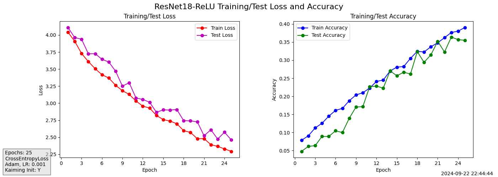{width=50%}
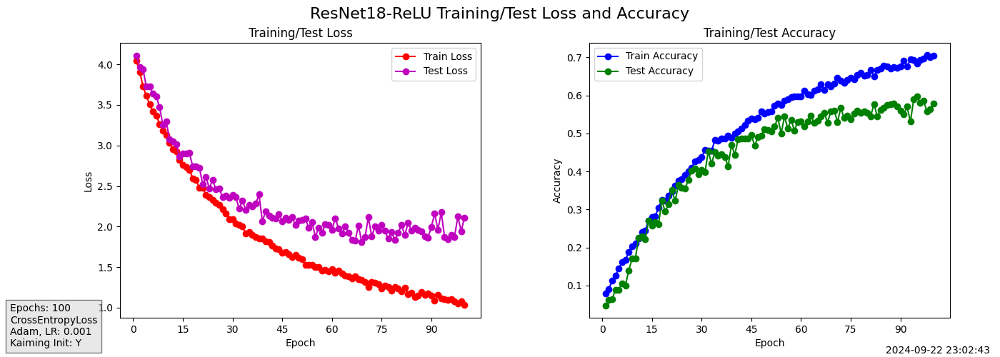{width=50%}
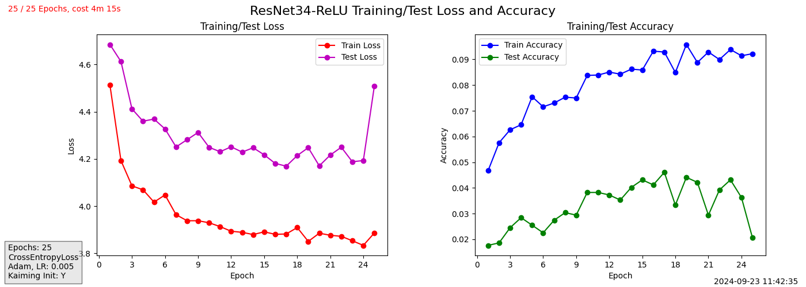{width=50%}
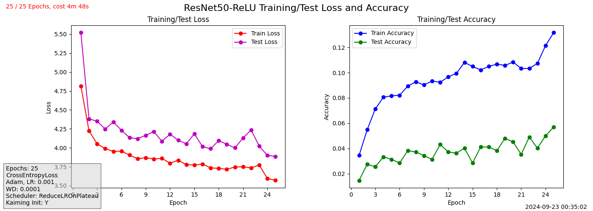{width=50%}

# 結論

在本次實驗中，對 Flowers102 資料集使用了多種深度學習模型，包括 Simple-Net 和不同版本的 ResNet，進行了詳細的性能評估與比較。結果顯示，Simple-Net 的測試準確率僅為 39.41%，而 ResNet-18 則達到了 93.14%。這一顯著差異主要來自 ResNet 引入了殘差連接（Residual Connections），使得深層網絡能夠有效避免梯度消失問題，從而捕捉到更深層的特徵。

與 Simple-Net 不同，ResNet 的殘差結構讓模型學習到更有效的表示，尤其是在較大資料集上，表現出強大的泛化能力。隨著 ResNet 模型的加深，如 ResNet-50 和 ResNet-152，雖然準確率略有提升，但這種增益相對有限，且資源消耗和計算成本顯著增加。這使得 ResNet-18 在效能和效率之間達到了最佳平衡。

實驗中還發現，Activation Function 的選擇對模型表現有顯著影響，SiLU 激活函數在訓練穩定性和性能表現上優於 ReLU 和 LeakyReLU。Scheduler 的實驗結果也表明，ReduceLROnPlateau 是最有效的學習率調整策略。此外，針對資料集的不平衡問題，儘管嘗試了多種資料處理方法，仍出現過擬合現象，顯示出資料處理方法對模型性能的潛在影響。

總結來看，ResNet-18 的表現足以應對 Flowers102 資料集的分類需求，並在性能和資源消耗之間取得了理想的平衡。未來的工作將重點放在進一步優化資料處理方法，以及探討更深層模型在更大規模資料集上的應用潛力。

# 參考資料

1. ChatGPT4o, ChatGPT o1-preview.
2. Shihyung. "Image Classification - Flower102." GitHub,\
 https://github.com/shihyung/image_classification_flower102
3. LeungSr. "【深度学习】图像识别实战102鲜花分类（flower 102）实战案例." \
CSDN, https://blog.csdn.net/LeungSr/article/details/126747940
4. He, Kaiming, et al. "Deep Residual Learning for Image Recognition." *Proceedings of the IEEE Conference on Computer Vision and Pattern Recognition*, 2016.