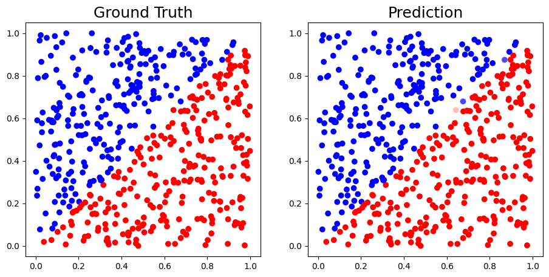
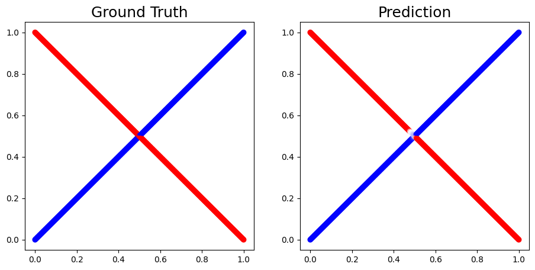
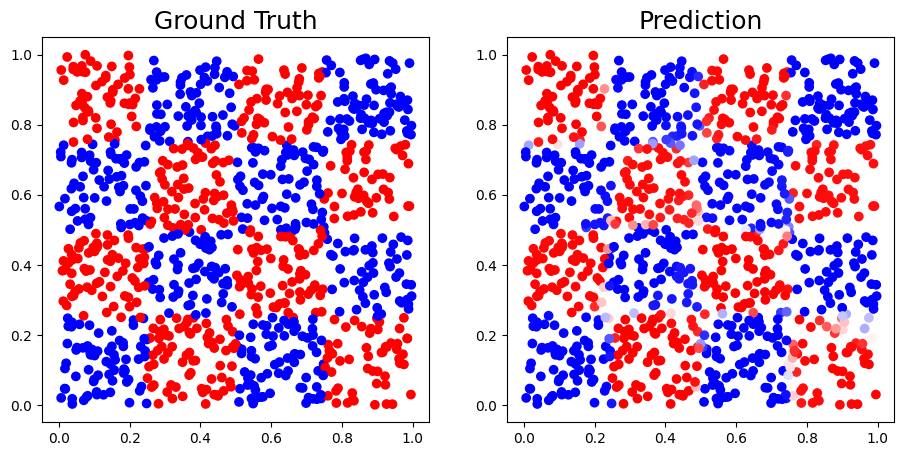

# 背景

在這次的實驗中，使用 Numpy 來實作一個具有三層隱藏層的神經網路，並包含前向傳播和反向傳播功能。這個神經網路的結構必須符合指定的節點數量，並且訓練與測試不同類型的數據，以觀察模型的表現。我們無法使用深度學習框架（如 TensorFlow、PyTorch），因此必須從零開始構建整個神經網路，這有助於深入理解神經網路的各個細節。 

# 模型簡介

這次實驗的主要目標是構建一個三層隱藏層的神經網路，其中每一層隱藏層的節點數量分別是 100、50 和 10。這個神經網路的實現需要包括前向傳播和反向傳播，並使用 sigmoid 函數作為激活函數。

## 模型封裝與優化

在最初的實現中，我手寫了每一層的權重矩陣作為 Numpy array，並在 SimpleNet 中直接定義了四層的結構。然而，這樣的方式使得模型的定義和前向、反向傳播的實作變得非常複雜，且不利於維護和閱讀。

```python
self.hidden1_weights = np.random.randn(input_size, 100)
self.hidden2_weights = np.random.randn(100, 50)
self.hidden3_weights = np.random.randn(50, 10)
self.output_weights = np.random.randn(10, output_size)
# Other biases, weights initialization and momentum...
```

為了解決這個問題，我抽象出了一個名為 `Linear` 的類別，用於表示單一層的線性變換。這樣的封裝方式大大提高了代碼的可讀性，使得我們能夠更專注於每一層的模型結構定義、前向傳播和反向傳播的運作。通過 `Linear` 封裝，每層的權重初始化、輸出計算和梯度更新都變得更加簡潔明確。

```python
class Linear:
    def __init__(self, input_size, output_size, ...):
        """A hand-crafted implementation of linear."""
        self.weights = np.random.randn(input_size, output_size) 
        ...

    def __update__(self, ...):
        ...

    def update(self, ...):
        ...
```

# 實驗方式

在實驗中，我分別對三種不同的數據集進行訓練與測試，並繪製了模型預測結果與真實值之間的比較圖。此外，我也嘗試了不同的激活函數，除了最初的 Sigmoid 函數之外，還嘗試使用 ReLU、LeakyReLU 和 SiLU 函數，並比較了不同激活函數對模型訓練的影響。

## Momentum

在實驗中，我在 update function 中加入 Momentum 計算。

```python
self.weight_momentum = \
    self.momentum * self.weight_momentum + learning_rate * weight_gradient
self.bias_momentum = \
    self.momentum * self.bias_momentum + learning_rate * bias_gradient
```

## Kaiming Initialization

在初始化權重時，我使用了 Kaiming Initialization 的方法，Kaiming Initialization 能夠有效地解決梯度消失和梯度爆炸的問題，並提高模型的收斂速度和性能。

```python
if is_kaiming and (activation_function == ReLU or activation_function == LeakyReLU):
    self.weights *= np.sqrt(2. / input_size)
elif is_kaiming and (activation_function == Sigmoid or activation_function == SiLU):
    self.weights *= np.sqrt(1. / input_size)
```

<!-- ## 超參數搜尋

將以上的優化技術結合在一起，我進行了超參數的搜尋，以找到最佳的模型參數。我對 momentum、weight decay、Kaiming Initialization 和激活函數進行了不同的組合，並通過網格搜索的方式找到最佳的超參數組合。

```python
param_grid = {
    'momentum': [0, 0.9, 0.95, 0.8, 0.7],
    'is_kaiming': [True, False],
    'activate_function': [Sigmoid, ReLU, LeakyReLU, SiLU]
}
``` -->

# 結果分析與觀察

在訓練過程中，我分別對三種不同的數據集進行訓練，並對模型的預測結果與真實值進行比較。我發現加入 momentum 和 weight decay 能有效提升模型的收斂速度與穩定性。momentum 使得梯度更新更具動量性，能夠幫助模型越過局部極小值，而 weight decay 則有效地抑制了過擬合的現象。

在激活函數的比較中，ReLU 函數相較於 sigmoid 函數在收斂速度上有著顯著的提升。由於 sigmoid 函數在輸入值過大或過小時會導致梯度消失，使得模型的訓練變得緩慢，而 ReLU 函數能夠更好地保持梯度，從而加速訓練過程。

## 實驗結果

以下是三種不同數據集的訓練結果，包括 Linear、XOR 和 Chessboard。Chessboard 是一個較為複雜的數據集，模型在這個數據集上的表現相對較差，僅仍能夠達到 95% 的準確率。

為了更明顯地展示模型的預測結果與實際值的差異，我使用了漸層顏色進行可視化。在 XOR 數據集中，雖然中心交叉處的兩邊邊界表現不同，但原因各異。一邊的邊界較為模糊，因為該區域數據分布較少；而另一邊的邊界則相對清晰，數據在該區域分布得更為密集。

|Dataset|Accuracy|Result|
|---:|:---:|:---:|
|Linear|0.9963|{width=70%}|
|XOR|0.9862|{width=70%}|
|Chessboard|0.9432|{width=70%}|

## 激活函數比較

在三個數據集（Linear、XOR 和 Chessboard）中，激活函數的表現有所不同。Linear 數據集中，所有激活函數幾乎都達到 100% 準確率，ReLU 和 LeakyReLU 表現最佳，達到 99.99%。在 XOR 數據集中，Sigmoid 和 LeakyReLU 的表現相對較好，分別達到 98.62% 和 98.79%，而 SiLU 表現最差，為 96.53%。在更複雜的 Chessboard 數據集中，ReLU 以 96.67% 表現最佳，而 SiLU 的表現最差，僅 51.50%。

SiLU 通常是最常用且最有效的激活函數之一，因為它平滑且非線性。然而，從數據來看，SiLU 在 XOR 和 Chessboard 上的表現不佳，特別是在 Chessboard 上僅有 51.50% 的準確率，遠低於其他激活函數。這與預期不符，可能需要進一步探討數據集特性對 SiLU 效果的影響。

||Linear|XOR|Chessboard|
|---:|:---:|:---:|:---:|
|Sigmoid|0.9963|0.9862|0.9432|
|ReLU|0.9999|0.9850|0.9667|
|LeakyReLU|0.9999|0.9879|0.9570|
|SiLU|0.9990|0.9653|0.5150|

# 總結

這次實驗讓我更深刻地理解了神經網路的工作原理，特別是在沒有現成框架的輔助下，需要自行實現每一步的過程。這種從零開始的方式讓我能更清楚地了解每個計算的細節，特別是反向傳播中梯度的傳遞機制與權重更新。

透過將每一層封裝為 `Linear` 類別，我有效地提高了代碼的可讀性和維護性，並能更專注於神經網路的結構設計與各層之間的運作。
