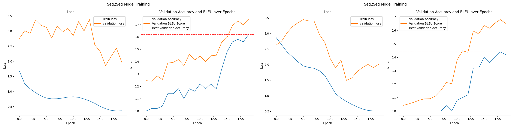

# 摘要

本次實驗的目標是利用 Seq2seq Transformer 模型進行英文拼寫修正任務，探討不同參數設定及模型結構對於拼寫修正效果的影響。本報告展示了模型的架構設計、訓練過程、以及性能分析，並對訓練結果進行了詳細的對比和討論。

# 背景

Transformer 模型由於其並行化和高效的特性，在 NLP 任務中取得了顯著的成效。本實驗旨在利用 Seq2seq Transformer 處理拼寫修正問題，針對字符級別進行修正，並通過 BLEU-4 分數與準確率來評估模型的效果。

# 模型使用

本實驗採用了自定義的 Seq2seq Transformer 模型，包括編碼器和解碼器部分。編碼器利用 TransformerEncoderLayer，而解碼器則基於 TransformerDecoderLayer[@pytorch_transformer]，嵌入層與位置編碼也加入模型中以提高字串的表示能力。

模型的具體設定為：

- Embedding Dimension：512
- Feed-forward Dimension：2048
- Number of Heads：8
- Number of Layers：6

<!-- ## Tokenizer

總共有 26 個英文字母，加上特殊符號 `[PAD]`、`[SOS]`、`[EOS]`，共 29 個 token。 -->

## Dataset

總共包含三個數據集：`train.json`、`test.json` 和 `new_test.json`。其中 `train.json` 用於模型訓練，`test.json` 用於模型驗證，`new_test.json` 用於最終的測試模型能力。

### 填充序列

```python
input_ids = self.padding_ids(
    [self.tokenizer.start_token] +
    input_ids +
    [self.tokenizer.end_token]
)
target_ids = self.padding_ids(
    [self.tokenizer.start_token] +
    target_ids +
    [self.tokenizer.end_token]
)
```

在數據集中，使用 `[PAD]` token 來填充序列，以確保每個 batch 的輸入序列長度相同。此外，輸入和目標序列都會在開頭和結尾分別加上 `[SOS]` 和 `[EOS]` token，以標記序列的起始和結束。

# 實驗方法

## 資料前處理

在原始的 `train.json` 中，資料品質參差不齊，例如出現以下情況：

- input: bank, target: dining
- input: a, target: at
- input: a, target: and
- input: a, target: have

為了提升資料的品質並提高模型的訓練效果，我使用了 `nltk` [@nltk_bleu] 的 `bleu_score` 來計算每個字串的 n-gram 分數，將 n-gram 分數低於 0.5 的資料過濾掉，從而去除一些無意義的樣本。

以下是過濾資料的 Python 代碼範例：

```python
def bleu_score(reference, candidate):
    return sentence_bleu(
        [reference], candidate,
        smoothing_function=SmoothingFunction().method4,
        weights=(1, 0, 0, 0)
    )

final_dataset = []

for data in train_dataset:
    input_text = data["input"]
    target_text = data["target"]
    if bleu_score(input_text, target_text) >= 0.5:
        final_dataset.append(data)
```

此方法能有效過濾掉無意義的資料，確保模型在訓練時使用更高品質的數據集。另外，此前處理僅為了資料品質實驗，除非特別說明，所有實驗仍然基於原始的 `train.json` 進行訓練。

## 模型初始化

```python
def xavier_uniform(self):
    for p in self.parameters(): 
        if p.dim() > 1:
            nn.init.xavier_uniform_(p)
```

模型的參數通過 Xavier Initialization 進行初始化，以提高模型的收斂效果。Xavier 初始化的理論基礎在於保持網路中每層的輸入和輸出變異數相等，這樣可以減少梯度在網路中逐層傳播時出現消失或爆炸的問題。這種初始化方式的具體做法是將權重設為服從均值為 0 且標準差為 $\frac{2}{n_{in} + n_{out}}$ 的分佈，其中 $n_{in}$ 和 $n_{out}$ 分別是輸入和輸出節點的數量。

Seq2seq 模型特別受益於 Xavier 初始化，因為這類模型涉及長序列的多層傳遞，且激活函數多為 sigmoid 或 tanh，它們更容易受到梯度消失的影響。Xavier 初始化能保持各層的輸入與輸出變異數一致，減少這個風險，從而增強訓練的穩定性。

數學上，Xavier 初始化將權重設定在範圍 $[-\sqrt{\frac{6}{n_{in} + n_{out}}}, \sqrt{\frac{6}{n_{in} + n_{out}}}]$ 的均勻分佈中，這樣能夠有效保持輸入和輸出變異數一致性，減少梯度在反向傳播中的變化。

## 平衡嵌入向量的幅度

```python
class Encoder(nn.Module):
    def __init__(self, ...):
        ...
        self.hid_dim = hid_dim

    def forward(self, ...):
        src = self.tok_embedding(src) * math.sqrt(self.hid_dim)
        ...
```

在 Transformer 的原始論文《Attention Is All You Need》[@vaswani2017attention] 中，作者在第 3.4 節 "Embeddings and Softmax" 中提到：

> We use learned embeddings to convert the input tokens and output tokens to vectors of dimension $d_{model}$. ... In the embedding layers, we multiply those weights by $\sqrt{d_{model}}$.

對於嵌入向量的幅度，如果過大會導致 softmax 函數的梯度過小，而過小則會導致梯度過大。為了平衡這一問題，作者將嵌入向量乘以 $\sqrt{{dim}_{model}}$，其中 ${dim}_{model}$ 是嵌入向量的維度。這樣可以確保嵌入向量的幅度與輸入向量的幅度相近，從而使 softmax 函數的梯度保持在一個合理的範圍內。

在實際應用中，可以在嵌入層的初始化過程中對嵌入向量進行縮放，是為了在嵌入維度變化時，保持嵌入向量的幅度適當，從而促進模型的穩定訓練和有效學習。

## 損失函數、優化器與學習率調整

使用 nn.CrossEntropyLoss，並將 padding token 設定為忽略的指標。最初選擇 SGD，學習率設為 0.05，隨後改用 AdamW，學習率設為 0.0001，並採用 CosineAnnealingLR 來調整學習率。

### `ignore_index` 參數在損失函數中的作用

```python
ce_loss = nn.CrossEntropyLoss(ignore_index=tokenizer.padding_token)
```

在使用 `nn.CrossEntropyLoss` 時，`ignore_index` 參數用於忽略特定的標籤，在計算損失時不會將其納入考慮。這對於處理填充（`[PAD]`）特別有用，因為它允許模型在計算損失時不考慮這些無效的填充部分，從而提升訓練效率和準確性。

# 結果分析與比較

## 訓練與驗證結果概述

在訓練過程中記錄了交叉熵損失、驗證集準確率與 *BLEU-4* 分數。實驗結果顯示，模型在 `test.json` 驗證資料集上達到了 100% 的準確率，而在 `new_test.json` 測試資料集上則達到了 68% 的準確率。

{ width=80% }

此圖顯示模型在訓練和驗證過程中的交叉熵損失與 *BLEU-4* 分數變化，訓練收斂情況良好。

<!-- ## 單字修正能力分析

在 `new_test.json` 測試資料集上對模型進行了輸入輸出評估，以下是部分測試樣例的結果：

| Input | Target | Prediction |
| --- | --- | --- |
| apreciate | appreciate | appreciate |
| luve | love | love |
| gorgeus | gorgeous | gorgeous |
| **thone** | **thong** | **phone** |
| **tomorraw** | **tomorraw** | **tomorrow** |
| **predgudice** | **prognice** | **prejudice** |

分析結果顯示，大多數情況下模型能夠成功將錯誤拼寫修正為正確單詞，但在某些案例（如 *thone*）中會出現錯誤修正，導致模型準確率的下降。 -->

## 超參數實驗結果

為了快速驗證不同超參數設置的效果，每個實驗僅運行了 20 個 epoch。

如圖 [@fig:baseline] 所示驗證資料集準確率為 72%，測試資料集準確率為 44%，也是後續實驗的基準結果。

{ width=50% #fig:baseline }

### 資料清洗對比

在這項實驗中，通過基於 *BLEU-1* 分數過濾資料集來分析資料清洗對模型準確率的影響。目的是篩選出更具代表性和質量的訓練數據，以觀察其對模型訓練結果的影響。結果如下：

| 實驗 | 驗證集準確率 | 測試集準確率 |
| --- | :---: | :---: |
| 原始資料集 | 72% | 44% |
| *bleu-1* $\geq 0.3$ | **78%** | 44% |
| *bleu-1* $\geq 0.4$ | 72% | **50%** |
| *bleu-1* $\geq 0.5$ | 72% | 42% |
| *bleu-1* $\geq 0.6$ | 74% | 42% |
| *bleu-1* $\geq 0.7$ | 68% | 36% |

資料清洗實驗顯示，適度過濾（BLEU-1 $\geq 0.4$）略微提升了測試準確率至 50%，但整體上不同的清洗標準對模型結果差距不大。更高的過濾條件 (BLEU-1 $\geq 0.5$ 及以上) 測試準確率稍降，但仍接近原始結果。

此結果說明資料清洗對模型提升有限，應謹慎選擇過濾標準，以保留具有學習價值的樣本，避免影響模型的多樣性和泛化能力。

### 模型初始化對比 和 嵌入向量幅度平衡

在模型初始化與嵌入向量幅度平衡的實驗中，比較了使用 Xavier 初始化和未使用初始化的模型效果，以及平衡與不平衡嵌入向量的影響。

- **無初始化**：驗證集準確率 62%，測試集準確率 32%。
- **無平衡嵌入向量**：驗證集準確率 44%，測試集準確率 28%。



### 忽略填充 Token 的影響與有無 Scheduler 的影響

在比較忽略填充 token 及使用學習率調度器的實驗中，測試了 185 個 epoch 的版本，結果顯示：

- **無忽略填充 token**：驗證集準確率 98%，測試集準確率 66%。
- **無學習率調度器**：驗證集準確率 98%，測試集準確率 62%。


使用策略（學習率調度器和忽略填充 token）提升了測試準確率至 68%，高於未使用策略的情況下的 66% 和 62%。這表明雖然這兩個策略對訓練過程的收斂性幫助有限，但對測試集的最終結果有輕微提升，顯示了略佳的泛化能力。

### 優化器與學習率比較

| 優化器 | 驗證集準確率 | 測試集準確率 |
| --- | --- | --- |
| SGD | 4% | 0% |
| Adam | 72% | 42% |
| **AdamW** | **74%** | **44%** |

| 學習率 | 驗證集準確率 | 測試集準確率 |
| --- | --- | --- |
| 5e-2 | 0% | 0% |
| 5e-4 | 0% | 0% |
| **1e-4** | **72%** | **44%** |
| 5e-5 | 58% | 28% |

結果顯示，選擇適當的優化器和學習率對模型的準確率影響顯著。AdamW 搭配學習率 1e-4 表現最佳，提供了最高的驗證和測試準確率。過高或過低的學習率會影響收斂速度，選擇如 AdamW 等合適優化器能提升模型穩定性並減少過擬合。

# 結論

Seq2seq Transformer 在拼寫修正任務中顯示出良好的性能，尤其是能有效地捕捉字符序列的上下文關係。實驗結果顯示，適當的參數調整與資料處理可以顯著提高模型的準確率與 BLEU-4 分數。未來的改進方向包括探索更多的嵌入方法與加入更多的數據擴充技術，以進一步提升模型的泛化能力。

最後，感謝老師和助教的指導，與強大的 GPT-4o, GPT-o1 preview [@chatgpt_website] 完成了本次作業。

# 參考資料

